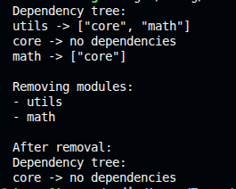

# WasmEdge Module Dependency Tree (Rust)

A minimal Rust project that models **WebAssembly (WASM) module dependencies** and demonstrates how a runtime can safely manage and remove modules based on their import relationships.

This project is inspired by how **WasmEdge and other WASM runtimes** manage module instances inside a store.

---

## Project Goal

To demonstrate understanding of:

- Rust data structures and ownership
- WebAssembly module dependency concepts
- Safe dependency cleanup logic
- How runtimes track and manage module relationships

---

## Core Idea

Each WASM module may depend on other modules.

Example:
```

A → B → C

```

If module **B** is removed:
- Module **A** must also be removed
- Module **C** remains (if nothing else depends on it)

This project models that behavior using Rust.

---

## Project Structure

```

wasmedge-dependency-tree/
├── src/
│   └── main.rs        # Dependency graph logic and demo
├── Cargo.toml
├── README.md
└── output.png         # Example program output

````

---

## Dependency Graph Model

```rust
HashMap<String, Vec<String>>
````

* **Key** → Module name
* **Value** → List of modules it depends on

Example:

```text
A -> [B, C]
B -> [C]
C -> []
```

---

## Features

* Add modules with dependencies
* Print the dependency tree
* Safely remove a module
* Automatically remove dependent modules
* Clean up remaining references

---

## How to Run

```bash
cargo run
```

---

## Example Output



What happens:

1. Initial dependency tree is printed
2. A target module is removed
3. All modules depending on it are also removed
4. Remaining dependency graph is updated safely

---

## How Safe Removal Works

1. Find all modules that depend on the target
2. Add them to a removal list
3. Remove those modules from the graph
4. Clean dangling dependencies using `retain`

This avoids:

* Dangling references
* Invalid dependency states

---

## Why This Project Matters

* Understanding of WASM module lifecycle
* Graph-based dependency reasoning
* Ownership-safe mutation in Rust
* Runtime-level thinking (not just app code)

Even though it is small, it mirrors **real WASM store behavior**.

---

## Possible Extensions

* Load real `.wasm` files
* Parse actual WASM imports
* Visualize dependency graph
* Integrate with WasmEdge APIs

---

## Author

**Tarun Karn**